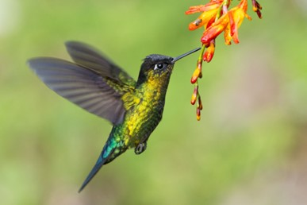
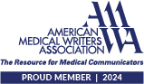

# 

## [About me](https://www.linkedin.com/in/shellyann-rose-235624/)

What I have always loved about my work is that I get to learn new things each day. It keeps my mind active and challenged and makes life interesting. Then I get to share what I learn so others can have that same positive experience. To me, good writing is really about two minds having a chat. My job is to actively listen to what my audience needs. Then provide clear, simple, readable prose in response. Achieving that with complex topics always gives me such a rush!

## Technical writing

Knowledgebase (KB) articles for the release notes (fixes and new features) in the Windows operating system (OS). Cross-functional partners: release management, product managers, software engineers, customer support. Key tools: docs-as-code, GitHub, Office 365 (MS Word, Excel), JSON, XML, Agile, Microsoft Style Guide, Flesch–Kincaid readability scores

* [February 11, 2025—KB5051987 (OS Build 26100.3194)](https://support.microsoft.com/en-us/topic/february-11-2025-kb5051987-os-build-26100-3194-63fb007d-3f52-4b47-85ea-28414a24be2d)
* [January 28, 2025—KB5050094 (OS Build 26100.3037) Preview](https://support.microsoft.com/en-us/topic/january-28-2025-kb5050094-os-build-26100-3037-preview-78fda0ea-79e9-468d-8a77-de7914ca1aef)
* [November 21, 2024—KB5046740 (OS Build 26100.2454) Preview](https://support.microsoft.com/en-us/topic/november-21-2024-kb5046740-os-build-26100-2454-preview-2040f716-b719-482a-8aff-f7f02c79b147)
* [February 29, 2024—Windows configuration update](https://support.microsoft.com/en-us/topic/february-29-2024-windows-configuration-update-aa44c0db-02a3-4161-bf06-e3c03a5f162e)
* [September 26, 2023—Windows configuration update](https://support.microsoft.com/en-us/topic/september-26-2023-windows-configuration-update-542780c2-594c-46cb-979d-11116fe164ba)
* [May 24, 2023—Windows configuration update](https://support.microsoft.com/en-us/topic/may-24-2023-windows-configuration-update-cae8524a-4b62-4d38-bb67-f070bd282fff)

### eLearning

* [Manage Windows updates for cloud-connected devices by using the Microsoft Graph PowerShell SDK](https://learn.microsoft.com/training/modules/manage-windows-updates-cloud-devices/)
* [Manage Windows updates in the cloud](https://learn.microsoft.com/training/modules/m365-windows-manage-cloud-device-updates/)

### Voice over

My voice over work for the videos that highlight the key improvements that are in the KB articles.

* [June 2022 KB5014697](https://support.microsoft.com/en-us/topic/june-14-2022-kb5014697-os-build-22000-739-cd3aaa0b-a8da-44a0-a778-dfb6f1d9ea11)
* [November 2022 KB5019980](https://youtu.be/srJjdxw6Gi0?si=sNkWjCuW8eck7JED)
* [August 2023 KB5029263](https://youtu.be/GJ6PhQzqNjM?si=7WDQb2LWk2JX833s)

### User experience design

* Presentation for [mobile app project called "Gabbi."](SRose_MobileAppProject_StayConnected.pdf) Key tools: Sketch, Balsamiq, and InVision

### API documentation

* [The Gracious Host Service](https://shellyannrose.github.io/warm-welcome-home-swap-hosting/) (mock REST API documentation)
* Learn about my 2024 API documentation class [experience](UWAPIjourney.md) at the University of Washington

## Biomedical writing

* [Informed consent form](SRoseInformedConsentMedWritingSample.pdf)  - Patient consent form for a mock clinical trial at Saint Joseph's University (formerly the University of the Sciences in Philadelphia)
* [Standard operating procedure (SOP)](SRose_SOP_Sample.pdf) - Chain of identity (COI) label SOP
* [Continuing medical education (CME) on colorectal cancer](SRose_CRC_LearningModule1.pdf) (medical editing)
* [Sleep gremlins: heterocyclic amines and insomnia](HCA_researchpaper_abstract.pdf)  - An abstract of my paper on human exposure to heterocyclic amines (HCAs). Key tools: Ovid, the Cochrane Database of Systematic Reviews, and PubMed; cited 110 clinical articles
* [Insomnia: The Unusual Suspects](BW890_SRose_Insomnia-1.pdf)  - Slide deck on my insomnia research paper. Key tools: PubMed, Microsoft PowerPoint

[Member of the Regulatory Affairs Professionals Society](https://www.raps.org/)

Copyright 2025 [Shellyann A. Rose](https://www.linkedin.com/in/shellyann-rose-235624/)
